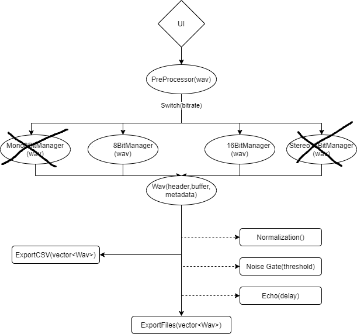

# Audio Processor

### Team
* Douglas Dawson
* Jarrit Learoyd
* Sukhreen Sandhu

### Objective
Take in all .wav files in working directory, process them into the program, apply effects processors, 
and finally write out the newly processed files. Additionally, obtain and print out all technical data
in a .csv file.

### Flow Design

